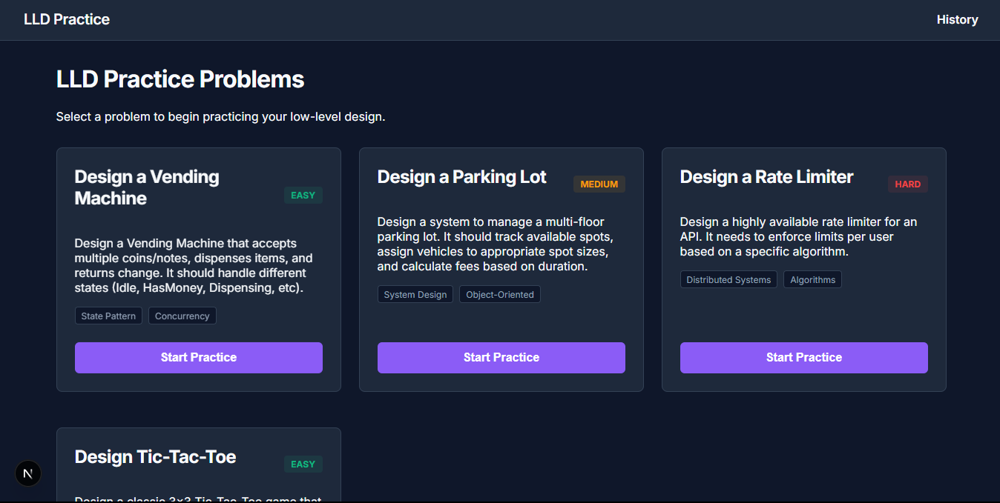

# 🧠 AI-Fluency LLD Practice Platform



A modern, AI-powered platform for practicing Low-Level Design (LLD) interviews. Unlike traditional competitive programming platforms, this project focuses on **design rationale and AI-fluency**.

## ✨ Features
- **Design Submission**: Submit your object-oriented design alongside your thought process.
- **AI Staff Engineer Feedback**: An AI evaluator pressure-tests your rationale to ensure you understand trade-offs and haven't blindly copied an LLM hallucination.
- **Interactive UI**: Built with Next.js App Router for a lightning-fast, reactive experience.
- **Asynchronous Evaluation Pipeline**: Reliable grading via a local SQLite backend without blocking the main UI thread.

## 🚀 Getting Started

### Prerequisites
- Node.js 18+
- npm or yarn

### Installation

1. Clone the repository:
   ```bash
   git clone https://github.com/c3-kyr/LLD-learning-platform.git
   cd LLD-learning-platform
   ```

2. Install dependencies:
   ```bash
   npm install
   ```

3. Start the development server:
   ```bash
   npm run dev
   ```

4. Open [http://localhost:3000](http://localhost:3000) in your browser.

*(Note: The prototype uses a local SQLite database, `lld-practice.db`, which is created and seeded automatically).*

## 🛠️ Tech Stack
- **Frontend/Backend**: [Next.js](https://nextjs.org/) (App Router)
- **Database**: [SQLite](https://sqlite.org/) (via `better-sqlite3`)
- **Styling**: Vanilla CSS (Tasteful Dark Theme)
- **Architecture**: Composite Pattern (`EvaluationPipeline`) for extensible grading.

## 🤖 AI Usage Report
Throughout the development of this prototype, AI was heavily utilized as a pair-programming partner:
- **Ideation & Research**: Brainstormed core learner problems and validated the product direction.
- **Architecture**: Defined the `SubmissionStateMachine` and the `Evaluator` interfaces, adhering to SOLID principles.
- **Code Generation**: Scaffolding the Next.js API routes, Database schema, and the React UI components.

Overall, AI acted as a force multiplier, allowing the rapid transition from raw research notes to a fully functional MVP.

---
*Built as a prototype for modern software engineering interview practice.*
